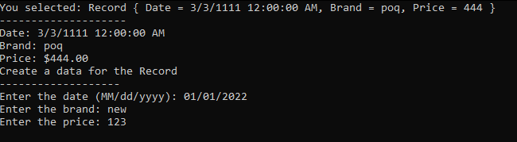

# LibraryAssignment

Architecture Description for LibraryAssignment Solution:

The LibraryAssignment solution consists of three projects: LibraryAssignment, LibraryAssignmentConsole, and LibraryAssignment.Tests.

## LibraryAssignment Project:
This project represents `the core library` of the solution.
- It contains the models and **functionality required to read, modify, and convert different file formats**.
- The FileFormatConverter class is implemented in this project, which provides methods to add and remove file formats, retrieve formats by name, and perform file format conversion.
- The `XmlFileFormat` and `BinaryFileFormat` classes inherit from the FileFormat base class and provide specific implementations for reading and writing XML and binary file formats.
- This project encapsulates the reusable logic for working with different file formats and serves as the foundation for the other projects in the solution.

## LibraryAssignmentConsole Project:
This project serves as `the entry point for the application` and provides a **console-based** interface for interacting with the library functionality.
Program.cs contains the main method that orchestrates the application flow.
- It interacts with the LibraryAssignment project by creating instances of the FileFormatConverter and invoking its methods to perform file format conversion and other operations.
- The console project acts as a user interface layer that enables users to interact with the library through command-line inputs and outputs.

## LibraryAssignment.Tests Project:
This project contains `the unit tests` for the LibraryAssignment project.
- It utilizes the `NUnit` testing framework along with `FluentAssertions` to write and execute unit tests.
- The tests cover various scenarios and ensure the correct behavior of the library's functionality.
- The unit tests provide a safety net for verifying that the library's code functions as expected, catches potential issues, and aids in maintaining the codebase's correctness over time.

Overall, this architecture follows a modular and layered approach. The `LibraryAssignment` project encapsulates the core logic and functionality, while the `LibraryAssignmentConsole` project acts as the user interface layer. The `LibraryAssignment.Tests` project ensures the reliability and correctness of the library through comprehensive unit tests.

By separating concerns and adhering to good architectural practices, such as encapsulation and modularity, the solution allows for easier maintenance, extensibility, and testability. Developers can add support for new file formats by implementing additional classes inheriting from the FileFormat base class and integrating them into the LibraryAssignment project.

## The strong sides of this library include:

- **Reusability**: The library provides a reusable and extensible solution for reading, modifying, and converting different file formats. New file formats can be added by simply creating a new class that inherits from the base FileFormat class.

- **Flexibility**: The library allows adding support for new user-supplied file formats without modifying the existing code. This makes it easy to incorporate new formats as needed.

- **Testability**: The library includes NUnit unit tests to validate its functionality. These tests ensure that the library behaves as expected and can help detect any issues or regressions during development.

- **Error Handling**: The library performs error handling by throwing exceptions when the specified restrictions are violated. This helps to catch and handle any invalid data or unexpected scenarios.

## Possible future development of the library could include:

- [ ] **Adding support for more file formats**: The library can be expanded by creating additional classes that handle other commonly used file formats, such as CSV, JSON, Excel, etc. This would enhance the versatility of the library and make it applicable to a wider range of use cases.

- [ ] **Enhanced error handling and validation**: The library could be further improved by implementing additional error handling and validation mechanisms to ensure the integrity and correctness of the data being processed. This could include more robust input validation, error logging, and reporting.

- [ ] **Integration with other frameworks or tools**: The library could be integrated with other frameworks or tools commonly used in the C# ecosystem, such as ASP.NET, Entity Framework, or Azure Functions. This would allow developers to leverage the file format capabilities within their existing projects seamlessly.

## NAnt

The nant script is named `build.xml`. \
The script includes the following `targets`:
- **clean**: Deletes the build directory.
- **restore**: Restores the NuGet packages for the solution.
- **build**: Builds the solution in Release mode.
- **test**: Runs the NUnit tests using the NUnit console runner.

The example:
```
nant -buildfile:build.xml build
```

## Images
NUnit tests:\
 \
Main menu: \
 \
Choose file type and enter file name: \

 \
Read records from a file: \
 \
Create a record: \
 \
Update a record: \
 \
Delete a record: \
 


